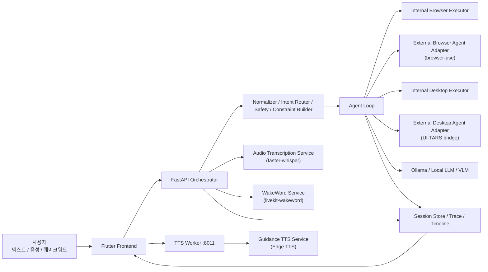

# VisionNavi Complete System Guide

## 1. 이 문서의 목적

이 문서는 VisionNavi 프로젝트를 처음 보는 사람도 한 번에 전체 구조를 이해할 수 있도록 만든 단일 기준 문서입니다.

이 문서만 읽어도 아래 질문에 답할 수 있도록 정리했습니다.

- VisionNavi는 어떤 프로젝트인가?
- 왜 이런 구조로 만들고 있는가?
- 현재 어떤 파일과 런타임이 어떤 역할을 하는가?
- 사용자의 명령은 실제로 어떻게 처리되는가?
- 어떤 부분은 하드코딩이고, 어떤 부분은 LLM/VLM이 실제로 개입하는가?
- 목표 대비 어디까지 구현되었는가?
- 지금 남아 있는 문제와 다음 우선순위는 무엇인가?

기존 `docs/` 아래의 문서들은 주제별 설계 노트나 발표 자료로 유지하고, 이 문서는 `docs/MustRead/` 안에서 전체 시스템 설명서 역할을 합니다.

---

## 2. VisionNavi 한 줄 소개

VisionNavi는 한국과 일본의 고령자를 주요 사용자로 상정한 음성·자연어 기반 보조 에이전트형 Windows 데스크톱 앱입니다.

사용자는 텍스트 또는 음성으로 명령을 말하고, VisionNavi는 그 명령을 해석한 뒤 브라우저나 Windows 데스크톱 앱을 실제로 조작해 작업을 수행하려고 합니다.

장기 목표는 단순 매크로나 고정 step 재생이 아니라, BrowserUse / ComputerUse류 오픈소스 에이전트 런타임을 VisionNavi 오케스트레이터 안에서 통합 운용하는 것입니다.

---

## 3. 왜 이 프로젝트가 필요한가

### 3.1 해결하려는 문제

고령자 입장에서 다음 작업들은 생각보다 어렵습니다.

- 복지 정보 검색
- 병원, 지도, 길찾기
- 유튜브 같은 사이트 탐색
- 메모 작성
- Windows 기본 앱 사용

기존 자동화는 보통 미리 정해둔 step을 실행하는 방식이 많습니다. 이런 방식은 화면 상태가 조금만 달라져도 쉽게 실패합니다.

예를 들어:

- 검색 엔진이 바뀌거나
- 검색창 위치가 조금 달라지거나
- 자동완성 후보가 예상과 다르거나
- 경로 검색에서 지도 UI가 바뀌거나
- 앱 창이 포커스를 잃거나
- 브라우저가 새 창으로 열리거나
- 언어가 한국어/일본어/영어로 섞여 버리면

단순 step 재생 구조는 바로 무너집니다.

### 3.2 VisionNavi가 지향하는 것

VisionNavi는 단순 자동화가 아니라 아래 구조를 지향합니다.

1. 사용자의 자연어 명령을 이해한다.
2. 명령을 안전하고 실행 가능한 형태로 정규화한다.
3. 어떤 실행 채널을 사용할지 결정한다.
4. 실제 브라우저 또는 데스크톱 앱을 조작한다.
5. 중간 상태를 관찰하고, 필요하면 복구한다.
6. 결과를 다시 사용자에게 이해하기 쉬운 방식으로 안내한다.

---

## 4. 프로젝트의 개발 역사

### 4.1 1단계: JSON step 기반 자동화

초기 구조는 다음과 같았습니다.

- 상위 planner 또는 LLM이 처음에 전체 JSON step을 한 번에 만든다.
- Python 실행기가 그 step을 순서대로 실행한다.

장점:

- 구조가 단순하다.
- 디버깅이 쉽다.
- 재현성이 높다.

한계:

- 화면이 조금만 달라져도 깨진다.
- 처음 계획이 틀리면 중간 복구가 어렵다.
- 실행 시점의 실제 상태를 반영하기 어렵다.

### 4.2 2단계: Runtime Binding / 규칙 기반 보정 확대

그 다음에는 intent, target, slot 정도만 고정하고, 실제 실행 시점에 snapshot이나 규칙으로 대상을 고르려는 방식으로 갔습니다.

장점:

- 고정 step보다 유연했다.
- 실행 시점 상태를 조금 더 반영할 수 있었다.

한계:

- 여전히 heuristic, score, handcrafted policy 비중이 컸다.
- 의미 해석이 어긋나면 잘못된 방향으로 갈 수 있었다.
- 복구도 “정책 기반 재시도” 수준을 넘기 어려웠다.

### 4.3 3단계: Continuous LLM-guided runtime 지향

이후 방향은 더 분명해졌습니다.

- LLM은 처음 해석만 하는 것이 아니라
- 실행 중에도 상황을 보고
- 다음 행동을 고르고
- 실패를 복구하는 데도 도움을 줘야 한다

이 방향 때문에:

- 로컬 LLM을 붙였고
- external browser / desktop agent runtime 통합을 실험하고
- trace, popup, TTS, wakeword, STT까지 포함한 보조 구조가 계속 추가되었습니다.

### 4.4 현재 단계: internal / external 공존 + external-first

현재 VisionNavi는 다음 2축이 공존합니다.

- internal browser / desktop executor
- external browser / desktop agent adapter

다만 개발 방향은 현재 `external-first`입니다.

즉:

- 신규 주 개발축은 external agent backend
- internal은 fallback, baseline, route 임시 유지, 비교 대상

으로 보는 것이 현재 프로젝트의 전략적 판단입니다.

---

## 5. 현재 프로젝트의 최종 목표

### 5.1 제품 목표

VisionNavi의 최종 목표는 다음과 같습니다.

- 고령자가 말 한마디 또는 짧은 텍스트만으로
- 웹 검색, 복지 정보 확인, 길찾기, 메모 작성, 간단한 데스크톱 업무를
- 실사용 가능한 수준으로 자동 수행하게 돕는 것

### 5.2 기술 목표

- BrowserUse류 브라우저 에이전트 통합
- ComputerUse / UI-TARS류 데스크톱 에이전트 통합
- wakeword + STT + LLM + TTS + UI 피드백의 결합
- 한국어 / 일본어 이중 언어 지원
- 고령자 친화 UI/UX

### 5.3 사용자가 계속 제기한 핵심 수정 지향점

프로젝트는 단순히 기능을 늘리는 방향이 아니라, 아래 문제들을 줄이는 방향으로 계속 수정되어 왔습니다.

- 명령이 다른 언어로 바뀌는 문제
- 네이버 요청이 구글이나 DuckDuckGo로 바뀌는 문제
- 검색어가 임의로 변경되는 문제
- 지도 요청에서 출발지/도착지/교통수단이 섞이는 문제
- 브라우저는 external, route는 internal 등 혼합 상태에서 생기는 구조적 혼란
- 화면은 고령자용인데 내부는 개발자 대시보드처럼 보이던 문제
- STT, wakeword, TTS가 클릭 기반/불안정하게 동작하던 문제

그래서 현재 구조는 “모델 교체보다 constraint를 먼저 고정”하는 방향으로 바뀌고 있습니다.

---

## 6. 현재 전체 시스템 구조

핵심은:

- UI가 직접 브라우저를 조작하지 않습니다.
- 모든 명령은 로컬 오케스트레이터를 거칩니다.
- 오케스트레이터가 canonical command를 만들고
- intent, safety, constraint를 정리한 뒤
- agent loop가 실행 백엔드를 선택합니다.

---

## 7. 루트 폴더 구조와 역할

### 7.1 저장소 루트 기준 주요 폴더

| 경로 | 역할 |
|---|---|
| `frontend/` | Flutter Windows 앱 |
| `orchestrator/` | FastAPI 기반 로컬 실행 서버와 에이전트 루프 |
| `runtime/` | 외부 에이전트, TTS, wakeword 모델/설정/로그 |
| `scripts/` | 실행, 재시작, 빌드, 학습, 벤치마크, 상태 추적 스크립트 |
| `docs/` | 설계 문서, 로드맵, 발표 자료 |
| `contracts/` | 프론트와 백엔드 사이 공유 계약/스키마 |
| `data/` | 학습·추론 관련 외부 데이터 자산 |
| `logs/` | 오케스트레이터 및 벤치마크 로그 |
| `outputs/` | 발표 자료, 산출물, 이미지 출력 |

### 7.2 저장소 밖에서 함께 쓰는 외부 폴더

| 경로 | 역할 |
|---|---|
| `D:\VisionNaviRuntime\orchestrator-venv` | 오케스트레이터 전용 Python 가상환경 |
| `D:\VisionNaviWakeword` | wakeword 학습용 외부 작업 디렉터리 |
| `D:\VisionNaviWakeword\data` | wakeword 학습 데이터 및 VoxCPM 자산 |
| `D:\VisionNaviWakeword\logs` | 학습 로그 |
| `D:\VisionNaviWakeword\output` | 학습 산출물 |

즉 VisionNavi는 저장소 안 코드만으로 끝나지 않고, 외부 Python 런타임과 wakeword 학습 자산 폴더까지 포함해 운영됩니다.

---

## 8. 프론트엔드 구조

### 8.1 핵심 역할

프론트엔드는 사용자의 입력과 피드백을 담당합니다.

- 메인 홈 화면
- 고령자용 사용자 모드 UI
- 설정 다이얼로그
- 텍스트 입력
- 음성 녹음 / STT 요청
- wakeword 상태 표시
- 팝업 안내
- 결과 TTS 재생

### 8.2 주요 파일

| 파일 | 역할 |
|---|---|
| `frontend/lib/main.dart` | Flutter 앱 진입점 |
| `frontend/lib/app/vision_navi_app.dart` | 앱 전역 구성 |
| `frontend/lib/app/theme/app_theme.dart` | 전체 테마 구성 |
| `frontend/lib/app/theme/colors.dart` | 색상 체계 |
| `frontend/lib/app/theme/typography.dart` | Pretendard 기반 타이포그래피 |
| `frontend/lib/features/home/presentation/home_screen.dart` | 메인 화면 상태, 음성/텍스트 입력, 세션 구독, wakeword/STT 상태 관리 |
| `frontend/lib/features/home/presentation/widgets/action_panel.dart` | 메인 액션 패널 구성 요소 |
| `frontend/lib/features/home/presentation/widgets/status_card.dart` | 상태 카드 UI |
| `frontend/lib/features/home/presentation/widgets/text_command_composer.dart` | 텍스트 명령 입력 UI |
| `frontend/lib/features/home/presentation/widgets/home_settings_dialog.dart` | 설정 화면 |
| `frontend/lib/features/home/models/home_user_settings.dart` | 사용자 설정 모델 |
| `frontend/lib/features/home/services/home_settings_store.dart` | 설정 저장/복원 |
| `frontend/lib/models/session_models.dart` | 세션, 이벤트, wakeword/STT 응답 모델 |
| `frontend/lib/services/orchestrator_client.dart` | FastAPI와 통신하는 HTTP/WebSocket 클라이언트 |
| `frontend/lib/services/result_tts_service.dart` | TTS 워커 호출 후 오디오 재생 |
| `frontend/lib/services/taskbar_popup_service.dart` | 작업 완료/안내 팝업 |

### 8.3 사용 라이브러리

`frontend/pubspec.yaml` 기준:

- `http`: 오케스트레이터 API 통신
- `audioplayers`: 결과 TTS 재생
- `record`: 음성 녹음
- `speech_to_text`: Windows 실시간 STT 시도
- `file_selector`: 음성 파일 첨부
- `window_manager`: Windows 창 크기/커스텀 타이틀바 제어

### 8.4 프론트엔드에서 실제로 하는 일

프론트는 “보여주기”만 하는 얇은 UI가 아닙니다.

- 세션 상태 구독
- 명령 canonicalization 요청
- 명령 실행 요청
- 파일 기반 STT 호출
- wakeword start/stop 호출
- wakeword 감지 상태 polling
- 오디오 진단 조회
- popup summary 생성 요청
- TTS 워커 호출 후 즉시 재생

즉 사용자 경험의 대부분은 프론트에서 관리하지만, 판단과 실제 실행은 오케스트레이터가 담당합니다.

---

## 9. 오케스트레이터 구조

### 9.1 핵심 역할

오케스트레이터는 VisionNavi의 중심입니다.

- 명령 정규화
- intent 분류
- safety 분류
- command constraint 생성
- 실행 백엔드 선택
- 브라우저/데스크톱 자동화 실행
- 세션 이벤트 기록
- STT / wakeword / TTS API 제공

### 9.2 주요 파일

| 파일 | 역할 |
|---|---|
| `orchestrator/app/main.py` | FastAPI 앱 진입점 |
| `orchestrator/app/api/routes/pipeline.py` | 전체 파이프라인 API |
| `orchestrator/app/agent/loop.py` | Agent loop, backend routing, phase/timeline 관리 |
| `orchestrator/app/core/settings.py` | 전체 환경 설정 |
| `orchestrator/app/services/command_normalizer.py` | 입력 정규화 |
| `orchestrator/app/services/intent_router.py` | 1차 intent 분류 |
| `orchestrator/app/services/safety_classifier.py` | 위험도 / 확인 필요 여부 판단 |
| `orchestrator/app/services/command_constraint_service.py` | provider / query / language 제약 추출과 검증 |
| `orchestrator/app/services/model_client.py` | Ollama / 원격 모델 API 호출 |
| `orchestrator/app/services/map_route_parser.py` | 지도 provider, 출발지/도착지/교통수단 파싱 |
| `orchestrator/app/services/session_store.py` | 세션 상태 및 이벤트 저장 |
| `orchestrator/app/services/audio_transcription_service.py` | faster-whisper 기반 STT |
| `orchestrator/app/services/wakeword_service.py` | livekit-wakeword 기반 호출어 감지 |
| `orchestrator/app/services/guidance_tts_service.py` | Edge TTS 합성 |
| `orchestrator/app/services/audio_diagnostics_service.py` | Windows 입력 장치 진단 |

### 9.3 API 레벨 흐름

`orchestrator/app/api/routes/pipeline.py`가 핵심 입구입니다.

이 파일은 아래 일을 합니다.

1. 명령을 받아 정규화한다.
2. intent, target, risk를 만든다.
3. command constraint를 만든다.
4. constraint validator로 1회 자동 보정/검증을 한다.
5. 세션을 생성한다.
6. agent loop를 비동기로 실행한다.
7. 프론트는 WebSocket/이벤트로 상태를 받는다.

이 파이프라인 때문에 VisionNavi는 단순 “버튼 → 스크립트 실행기”가 아니라, 명령 해석 레이어가 따로 있는 구조를 갖습니다.

---

## 10. 모델, 라이브러리, 런타임 구성

### 10.1 현재 주요 모델

`orchestrator/app/core/settings.py` 기준 기본값:

| 용도 | 현재 기본 모델 |
|---|---|
| 일반 canonicalization / popup / reasoning | `qwen2.5:14b` |
| planner / next action / external browser agent model | `qwen2.5:7b` |
| VLM / external desktop agent model | `qwen2.5vl:3b` |

### 10.2 현재 주요 Python 라이브러리

`orchestrator/requirements.txt` 기준:

- `fastapi`, `uvicorn`: 오케스트레이터 API 서버
- `pydantic`: 모델과 계약
- `playwright`: 브라우저 제어
- `browser-use[core]`: external browser agent
- `pywinauto`, `pywin32`: internal desktop 자동화
- `faster-whisper`: STT
- `livekit-wakeword[listener]`: wakeword 감지
- `httpx`: 모델/API 통신
- `pytest`: 테스트

### 10.3 현재 주요 외부 런타임

| 구성 | 역할 |
|---|---|
| Ollama | 로컬 LLM/VLM 추론 서버 |
| Chrome CDP | 기존 사용자 Chrome 세션 재사용 브라우저 제어 |
| browser-use | external browser agent |
| UI-TARS bridge | external desktop agent 연결 |
| Edge TTS | 한국어/일본어 안내 음성 합성 |
| Edge TTS | 일부 음성 fallback 또는 음성 선택 경로 |
| faster-whisper | 오디오 파일 STT |
| livekit-wakeword | 웨이크워드 감지 |

---

## 11. CanonicalCommand와 Constraint 구조

### 11.1 CanonicalCommand

`orchestrator/app/models/canonical_command.py`

VisionNavi의 모든 실행은 결국 `CanonicalCommand`를 중심으로 돌아갑니다.

주요 필드:

- `input_mode`: `voice` / `text`
- `raw_text`: 원문
- `normalized_text`: 정규화된 명령
- `task_domain`: `web` / `desktop` / `hybrid`
- `intent`
- `risk_level`
- `requires_confirmation`
- `target_app`
- `notes`
- `constraints`

### 11.2 왜 constraint가 중요한가

이전에는 LLM이 검색어를 바꾸거나, provider를 바꾸거나, 언어를 바꾸는 문제가 계속 있었습니다.

이를 막기 위해 `CommandConstraint`가 들어왔습니다.

`orchestrator/app/models/command_constraint.py`

핵심 필드:

- `provider`
- `query_text`
- `expected_language`
- `allow_provider_switch`
- `allow_query_rewrite`
- `allow_language_shift`
- `allow_cross_provider_fallback`
- `route_context`

위반 taxonomy:

- `provider_mismatch`
- `query_changed`
- `unexpected_language`
- `unsupported_constraint_extraction`
- `constraint_repair_failed`

### 11.3 현재 구조적 의미

이 구조는 단순 옵션이 아니라, 앞으로 VisionNavi의 안정성을 좌우하는 핵심입니다.

즉:

- “네이버에서 검색해줘”인데 구글로 가면 안 된다
- “유튜브에서 김연자 영상 찾아줘”인데 검색어를 중국어로 바꾸면 안 된다
- “카카오맵에서”인데 네이버지도로 바뀌면 안 된다

를 모델 성능이 아니라 구조 차원에서 먼저 막으려는 것입니다.

---

## 12. Intent 체계와 현재 실행 방식

### 12.1 현재 존재하는 intent

`orchestrator/app/services/intent_router.py` 기준 현재 intent는 아래와 같습니다.

| intent | task_domain | 기본 target |
|---|---|---|
| `find_map_route` | `web` | `naver_map` 또는 `kakao_map` |
| `search_and_read` | `web` | `browser` |
| `inspect_workspace_files` | `desktop` | `file_explorer` |
| `open_notepad_and_type` | `desktop` | `notepad` |
| `change_system_setting` | `desktop` | `windows_settings` |
| `general_assistance` | `hybrid` | 없음 |

### 12.2 intent별 “얼마나 agent형인가”

| intent | 현재 주 경로 | 하드코딩 비중 | LLM 개입 비중 | VLM 영향 |
|---|---|---:|---:|---:|
| `search_and_read` | external browser 우선 | 중간 | 높음 | 낮음 |
| `find_map_route` | internal browser baseline 중심 | 높음 | 낮음~중간 | 매우 낮음 |
| `open_notepad_and_type` | external desktop 우선, internal fallback | 중간 | 중간 | 중간 |
| `inspect_workspace_files` | internal desktop | 높음 | 낮음 | 거의 없음 |
| `change_system_setting` | internal desktop | 높음 | 낮음 | 거의 없음 |
| `general_assistance` | 아직 약함 | 높음 | 낮음 | 거의 없음 |

#### 중요한 해석

1. `search_and_read`

- 현재 VisionNavi에서 external-first가 가장 잘 반영된 intent입니다.
- browser-use 기반 external browser agent가 실제 연결됩니다.
- 다만 provider drift, query drift, off-target navigation 문제가 있었고, 이를 constraint-first 구조로 제어하는 중입니다.

2. `find_map_route`

- 사용자는 agent형을 기대하지만, 현재는 internal deterministic baseline 비중이 큽니다.
- 즉 “LLM이 매 턴 화면을 보고 자유롭게 해결한다”기보다,
- site 분기와 route 처리 로직이 아직 시나리오 종속적으로 많이 들어가 있습니다.

3. `open_notepad_and_type`

- external desktop agent(UI-TARS bridge)가 연결되어 있습니다.
- 하지만 저장 검증, timeout, 반복 성공률 면에서는 아직 PoC 성격이 강합니다.

### 12.3 “하드코딩인가, LLM이 실제로 고르나?”

이 질문은 VisionNavi를 이해할 때 가장 중요합니다.

정리하면:

- 완전 하드코딩만은 아닙니다.
- 그렇다고 전부 LLM이 자율적으로 결정하는 것도 아닙니다.

현재는 intent마다 다릅니다.

#### 거의 하드코딩에 가까운 부분

- `change_system_setting`
- `inspect_workspace_files`
- route 일부 deterministic flow
- internal desktop action step

#### LLM이 실질적으로 개입하는 부분

- canonicalization
- action planning
- external browser agent step 선택
- popup 요약 생성
- 일부 desktop external instruction 해석

#### 아직 VLM 영향이 거의 없는 부분

- 일반 웹 검색 성공 경로 대부분
- internal route baseline
- internal desktop deterministic flow

#### VLM 영향이 있는 부분

- external desktop agent에서 화면 기반 desktop 행동
- 일부 vision observation path

하지만 현재 전체 프로젝트 기준으로 보면,

**VLM은 코드상 존재하지만, 실사용 성공률을 지배하는 주축은 아직 아닙니다.**

---

## 13. Agent Loop와 backend 선택

### 13.1 backend 종류

`orchestrator/app/models/execution_backend.py`

- `internal_browser`
- `external_browser_agent`
- `internal_desktop`
- `external_desktop_agent`

### 13.2 현재 기본 정책

`orchestrator/app/core/settings.py` 기준:

- `default_browser_execution_backend = external_browser_agent`
- `default_desktop_execution_backend = external_desktop_agent`

즉 정책상 기본은 external-first입니다.

### 13.3 실제 해석

정책이 external-first라고 해서 모든 intent가 external로 완성된 것은 아닙니다.

현재 현실은 다음과 같습니다.

- 브라우저 일반 검색은 external 우선
- 데스크톱 메모장도 external 우선
- 그러나 `find_map_route`는 아직 internal baseline 비중이 큼
- external 실패 시 internal fallback이 허용되는 구조도 남아 있음

### 13.4 AgentLoop의 역할

`orchestrator/app/agent/loop.py`

AgentLoop는:

- observe
- plan
- act
- verify
- recover

단계를 세션 이벤트로 남기고, 요청 backend와 실제 backend를 조정하며, 실행 결과를 정규화합니다.

즉 VisionNavi의 “에이전트성”은 이 루프에서 표현됩니다.

---

## 14. 브라우저 자동화 구조

### 14.1 internal browser

주요 파일:

- `orchestrator/app/automation/browser/executor.py`

역할:

- Playwright 기반 브라우저 제어
- Chrome CDP 연결
- search-and-read internal flow
- map route internal flow
- iterative browser task 지원

특징:

- 기존 Chrome 디버그 포트(`127.0.0.1:9222`) 재사용 구조
- 사용자가 평소 쓰는 브라우저 세션/프로필과 더 가깝게 동작하도록 설계
- route 시나리오는 여기 의존도가 아직 높음

### 14.2 external browser

주요 파일:

- `orchestrator/app/automation/browser/external_agent_adapter.py`

역할:

- `browser-use`를 VisionNavi 계약에 맞게 감쌉니다.
- preflight validation
- task prompt 작성
- CDP attach
- raw trace / normalized trace 생성
- postflight validation

현재 지원 intent:

- 사실상 `search_and_read` 중심

### 14.3 현재 브라우저 쪽 구조적 문제

사용자가 계속 지적했던 문제와 현재 상태는 아래와 같습니다.

1. provider drift

- 네이버 요청이 구글/DuckDuckGo로 바뀌는 문제
- 현재 constraint로 막는 구조가 들어가고 있음

2. query drift

- 검색어가 임의로 변형되는 문제
- `query_text` constraint와 validator로 막는 방향

3. language drift

- 한국어/일본어 명령이 중국어/영어 쿼리로 바뀌는 문제
- `expected_language` constraint로 통제 중

4. 속도 문제

- “유튜브에서 전국노래자랑 영상 검색해줘” 같은 비교적 단순한 명령도
- 브라우저가 뜨기까지 1분 내외가 걸리는 경우가 있음
- 이건 모델 추론, external agent step, 브라우저 준비, constraint 검증, fallback 가능성 등이 겹친 결과입니다.

즉 VisionNavi 브라우저 자동화는 “기능 존재” 단계는 넘었지만, “실사용 속도 최적화”는 아직 미완입니다.

---

## 15. 데스크톱 자동화 구조

### 15.1 internal desktop

주요 파일:

- `orchestrator/app/automation/desktop/executor.py`

역할:

- Notepad 실행과 텍스트 입력
- 작업공간 탐색
- Windows 설정 변경
- action step 순차 실행

특징:

- 상대적으로 deterministic
- pywinauto 기반 관찰 가능
- 고정 시나리오에 강하지만 범용성은 제한적

### 15.2 external desktop

주요 파일:

- `orchestrator/app/automation/desktop/external_agent_adapter.py`
- `runtime/external_agents/ui_tars_bridge/run_ui_tars.js`

역할:

- UI-TARS bridge를 이용한 external desktop agent 호출
- Notepad 사전 실행
- bridge payload 생성
- 결과 검증
- retry / taxonomy 기록

현재 현실:

- 연결은 되어 있음
- trace도 남김
- 하지만 반복 성공률과 안정성은 아직 internal보다 약함

즉 external desktop은 “붙었다” 수준을 넘어서고는 있지만, 아직 생산 경로라고 부르기엔 이른 상태입니다.

---

## 16. STT 구조

### 16.1 현재 STT 경로

주요 파일:

- `frontend/lib/features/home/presentation/home_screen.dart`
- `frontend/lib/services/orchestrator_client.dart`
- `orchestrator/app/services/audio_transcription_service.py`

구조:

1. 사용자는 음성 파일 첨부 또는 녹음을 한다.
2. 프론트는 `/pipeline/transcribe-audio`를 호출한다.
3. 오케스트레이터는 `faster-whisper`로 전사한다.
4. 결과 텍스트를 다시 프론트로 돌려준다.

### 16.2 현재 사용 모델

- `faster-whisper`
- 기본 모델: `medium`
- compute type: `int8`
- beam size: `8`
- VAD filter 사용

### 16.3 장점과 한계

장점:

- 로컬 처리 가능
- 파일 기반 테스트 가능
- 한국어/일본어를 모두 처리 가능

한계:

- 소음 환경에서 오인식 가능
- 일본어는 한국어 발음처럼 잘못 전사되던 사례가 있었음
- 실시간 STT와 wakeword 이후 자동 전사 파이프라인은 아직 안정화 중

---

## 17. Wakeword 구조

### 17.1 현재 구조

주요 파일:

- `orchestrator/app/services/wakeword_service.py`
- `runtime/wakewords/manifest.json`
- `runtime/wakewords/configs/*.yaml`
- `scripts/start_wakeword_training_*.ps1`

구성:

- backend: `livekit-wakeword`
- manifest 기반 profile 선택
- 언어별 wakeword ONNX 모델 사용

현재 manifest 기준 profile:

- 한국어
  - `ko_nabiya` → “나비야”
  - `ko_hey_nabi` → “헤이 나비”
- 일본어
  - `ja_nee_navi` → “ねえ、ナビ”
  - `ja_navisan` → “ナビさん”

### 17.2 현재 모델 파일

`runtime/wakewords/models/`

- `ko_nabiya.onnx`
- `ko_hey_nabi_dev.onnx`
- `ja_nee_navi.onnx`
- `ja_navisan_dev.onnx`
- 그 외 dev/micro 모델들

### 17.3 학습 관련 외부 폴더

학습 자체는 저장소 밖의 `D:\VisionNaviWakeword`를 함께 사용합니다.

예:

- `D:\VisionNaviWakeword\data`
- `D:\VisionNaviWakeword\logs`
- `D:\VisionNaviWakeword\output`

### 17.4 현재 상태

한국어 wakeword는 사용자가 “잘 감지한다”고 확인한 상태입니다.

반면 일본어 wakeword는 아직 문제가 남아 있습니다.

사용자가 보고한 문제:

- 감지가 전혀 안 됨
- 혹은 말을 안 해도 오탐함
- 일본어 STT는 정상 전사되는데 wakeword만 약함

현재까지 확인한 구조적 원인 후보:

1. 학습 품질 차이

한국어 `ko_nabiya`는 상대적으로 큰 학습 설정을 사용했습니다.

반면 일본어 모델은 한동안 훨씬 작은 설정으로 학습되어 품질 차이가 컸습니다.

이후 일본어 prod 재학습을 시작했고, 현재 로그상 `ja_nee_navi`는 다시 학습 중입니다.

2. 오디오 장치 경로 문제

Windows 기본 입력 장치, 원격 오디오, Bluetooth hands-free 장치 간 경로 차이가 있고, 일부 장치는 PyAudio / sounddevice로 열 때 host error가 확인되었습니다.

다만 사용자의 실제 관찰상 한국어 wakeword는 동작하므로, 일본어 문제는 오디오 장치 문제만으로 설명되지는 않고 모델 품질 문제 비중이 더 큽니다.

### 17.5 현재 학습 진행 상태

최근 확인된 로그:

- `D:\VisionNaviWakeword\logs\wakeword_training_japanese_prod.log`
- `ja_nee_navi.yaml` 기준
- `positive_train 320 / 1600`부터 재개 중

즉 일본어 웨이크워드는 “미연결”이 아니라 “연결은 되어 있지만 모델 품질이 아직 충분치 않은 상태”로 보는 것이 맞습니다.

---

## 18. TTS 구조

### 18.1 현재 구조

주요 파일:

- `frontend/lib/services/result_tts_service.dart`
- `runtime/external_agents/edge_tts_worker/server.py`
- `orchestrator/app/services/guidance_tts_service.py`
- `scripts/start_tts_worker.ps1`

현재 구조는 “전용 상시 TTS 워커 + 프론트 재생”입니다.

흐름:

1. 프론트가 `127.0.0.1:8011/synthesize` 호출
2. TTS worker가 `GuidanceTtsService`를 호출
3. 오디오 파일을 `runtime/tts_output/`에 생성
4. 프론트가 `audioplayers`로 즉시 재생

### 18.2 왜 전용 워커를 따로 뒀는가

이전에는 TTS 응답이 매우 느리거나, 한국어가 거의 재생되지 않는 문제가 컸습니다.

그래서:

- 상시 떠 있는 전용 TTS worker를 분리했고
- 그 결과 응답 속도는 크게 개선되었습니다.

사용자 피드백상 최근에는 “드디어 바로 동작한다” 수준까지는 올라온 상태입니다.

### 18.3 현재 제공 음성

현재 UI상 실질적으로 검증된 음성은 제한적입니다.

한국어:

- `SunHi`
- `InJoon`
- `Hyunsu`

일본어:

- `Nanami`
- `Keita`

다른 voice는 드롭다운에 있더라도 실제 출력이 불안정할 수 있습니다.

### 18.4 현재 한계

- 한국어는 과거에 거의 재생이 안 되던 문제가 있었음
- 현재 구조는 개선되었지만, 사용자는 아직 목소리가 다소 인공적이라고 느끼고 있음
- 음성 선택 UI와 실제 voice 반영이 계속 조정 중

즉 “동작성”은 좋아졌지만 “자연스러움”은 다음 단계 과제입니다.

---

## 19. popup / 사용자 피드백 구조

VisionNavi는 단순히 결과 JSON만 남기지 않고, 사용자가 이해할 수 있게 안내하려고 합니다.

현재 관련 구성:

- popup summary 생성 API
- taskbar popup
- 결과 TTS 재생
- 화면 상단 헤드라인 변경

예:

- “무엇을 도와드릴까요?”
- “음성을 듣고 있어요”
- “명령을 이해하고 있어요”
- “화면을 이동하고 있어요”

다만 현재는 상태 문구끼리 충돌하는 문제가 남아 있습니다.

예:

- 제목은 “명령을 이해하고 있어요”인데 오른쪽 마이크는 “전사 중”
- 화면 이동 중인데 하단에는 “호출어 대기 중”

즉 사용자 문구 상태머신은 아직 정리가 필요한 영역입니다.

---

## 20. 현재 메인 UI 구조와 상태

### 20.1 방향

UI는 개발자용 화면에서 벗어나, 고령자 친화 메인 화면으로 계속 바뀌고 있습니다.

현재 핵심 방향:

- 큰 말하기 버튼
- 간단한 텍스트 입력
- “이렇게 말해보세요” 예시
- “자주 하는 작업” 4개 카드
- 디버그 정보는 숨김
- 설정 / 도움말 분리

### 20.2 최근 큰 변화

- Windows 기본 title bar 제거, 커스텀 타이틀바 도입
- 메인 홈 화면 고정 비율 조정
- 사용자 모드 완전 한글화/일본어화 방향
- 고령자용 1열 중심 UX

### 20.3 아직 남은 UI 과제

- 설정 다이얼로그 레이아웃 정리
- 고대비 / 다크 모드 테마 일관성
- 고대비와 다크모드 상호 배타 처리
- 상태 문구 동기화
- 텍스트 입력 모드 단순화

즉 사용자 모드는 “형태는 거의 갖췄지만, 디테일 polish가 아직 필요한 상태”입니다.

---

## 21. 현재 설정 체계

`frontend/lib/features/home/models/home_user_settings.dart`

현재 사용자 설정에는 아래가 포함됩니다.

- 언어
- 음성 입력 사용 여부
- 전사 후 자동 진행 여부
- wakeword 사용 여부
- wakeword phrase
- wakeword threshold
- 마이크 민감도
- 안내 속도 / 음량
- 한국어 / 일본어 TTS voice
- 시작 시 실행
- 민감 작업 승인 관련 옵션
- 고대비 / 다크 테마 / 큰 글씨 / 화면 스케일

즉 설정은 이미 꽤 넓지만, 모든 항목이 동일한 완성도를 가진 것은 아닙니다.

예:

- 저장 자체는 연결된 항목이 많음
- 그러나 실제 플랫폼 레벨까지 완전히 반영되지 않은 항목도 있음
- 특히 테마와 wakeword 관련 UX는 아직 계속 조정 중

---

## 22. scripts 폴더 정리

### 22.1 운영/개발 핵심 스크립트

| 파일 | 역할 |
|---|---|
| `scripts/setup_orchestrator_env.ps1` | 오케스트레이터 Python 환경 준비 |
| `scripts/run_orchestrator.ps1` | 오케스트레이터 실행 |
| `scripts/run_orchestrator_ollama.ps1` | Ollama 연동 모드 실행 |
| `scripts/restart_orchestrator.ps1` | 오케스트레이터 재시작 |
| `scripts/restart_orchestrator_and_build.ps1` | 오케스트레이터 재시작 + Flutter build |
| `scripts/restart_orchestrator_and_build.cmd` | 더블클릭용 래퍼 |
| `scripts/start_tts_worker.ps1` | 전용 TTS 워커 시작 |
| `scripts/run_chrome_debug.ps1` | Chrome 디버그 채널 관련 실행 |

### 22.2 벤치마크/실험 스크립트

| 파일 | 역할 |
|---|---|
| `scripts/run_external_browser_benchmark.py` | external browser 벤치마크 |
| `scripts/run_external_desktop_benchmark.py` | external desktop 벤치마크 |

### 22.3 wakeword 관련 스크립트

| 파일 | 역할 |
|---|---|
| `scripts/start_wakeword_training_all.ps1` | wakeword 전체 학습 |
| `scripts/start_wakeword_training_dev.ps1` | dev 학습 |
| `scripts/start_wakeword_training_prod.ps1` | prod 학습 |
| `scripts/start_wakeword_training_remaining_prod.ps1` | 남은 prod 학습 직렬 처리 |
| `scripts/start_wakeword_training_japanese_prod.ps1` | 일본어 wakeword prod 학습 |
| `scripts/watch_wakeword_prod_training.ps1/.cmd` | prod 학습 상태 추적 |
| `scripts/watch_wakeword_japanese_prod_training.ps1/.cmd` | 일본어 prod 학습 추적 |
| `scripts/check_wakeword_training_status.ps1` | 상태 확인 |
| `scripts/train_wakeword_model.ps1` | 개별 모델 학습 진입 |

### 22.4 참고

이 스크립트들은 단순 편의 기능이 아니라 실제 운영 구조의 일부입니다.

특히 VisionNavi는:

- Python env
- TTS worker
- orchestrator
- wakeword training

이 각각 분리된 실행 단위를 가지므로, 스크립트 없이 수동 운영하기가 어렵습니다.

---

## 23. contracts / data / logs / outputs 정리

### 23.1 contracts

`contracts/canonical_command.schema.json`

- canonical command 구조를 명시하는 공유 계약입니다.

### 23.2 data

`data/voxcpm/VoxCPM2`

- wakeword 데이터 생성 및 관련 자산에 쓰이는 외부 데이터입니다.

### 23.3 logs

현재 로그에는 다음이 포함됩니다.

- 오케스트레이터 stdout/stderr
- Ollama 모드 로그
- external browser benchmark 로그
- external desktop benchmark 로그

즉 실행 품질 분석과 회귀 추적을 위해 로그 자산도 프로젝트 일부로 봐야 합니다.

### 23.4 outputs

- 발표 자료
- 발표 이미지
- 기타 산출물

현재는 `visionnavi-midterm-presentation.pptx` 등 발표용 산출물도 포함되어 있습니다.

---

## 24. 실제 동작 흐름 상세

### 24.1 텍스트 명령

1. 사용자가 텍스트를 입력한다.
2. 프론트가 `/pipeline/canonicalize` 또는 `/pipeline/run` 호출
3. 오케스트레이터가 정규화 + intent + risk + constraint 생성
4. validator가 1회 자동 보정 / 검증
5. 세션 생성
6. AgentLoop가 backend를 선택
7. browser 또는 desktop 실행
8. 결과 / trace / popup summary 생성
9. 프론트가 상태를 보여주고 TTS 재생

### 24.2 음성 파일 기반 명령

1. 사용자가 음성 파일 첨부
2. 프론트가 `/pipeline/transcribe-audio` 호출
3. faster-whisper가 전사
4. 전사 결과를 텍스트 명령으로 다시 canonicalize
5. 이후 텍스트 명령과 동일 경로로 실행

### 24.3 wakeword 기반 명령

1. 프론트가 wakeword monitoring 시작
2. 오케스트레이터의 `WakeWordService`가 모델 감시
3. wakeword 감지 시 프론트가 listening 상태로 전환
4. 이후 실시간 녹음/STT
5. 일정 묵음 이후 자동 종료
6. 전사 결과를 실행 요청으로 넘김

이 구조는 현재 거의 완성형에 가깝게 연결되었지만, 일본어 wakeword 품질과 상태 동기화 문제가 남아 있습니다.

---

## 25. 현재 목표 대비 구현 정도

| 목표 | 현재 상태 | 설명 |
|---|---|---|
| 고령자용 메인 UI | 진행중 | 메인 구조는 갖췄지만 테마/설정/polish 필요 |
| 텍스트 명령 처리 | 완료에 가까움 | canonicalize, run, timeline, popup 연동 가능 |
| 음성 파일 STT | 완료에 가까움 | faster-whisper 기반 동작 |
| 실시간 STT | 진행중 | 일부 동작하나 사용자 경험 일관성 부족 |
| 한국어 wakeword | 제한적 완료 | 감지는 비교적 잘 되지만 운영 품질 검증 더 필요 |
| 일본어 wakeword | 미완성 | 모델 품질 및 감지 안정성 부족 |
| browser external-first | 진행중 | search-and-read 위주로 연결됨 |
| desktop external-first | 진행중 | Notepad 중심 PoC 수준 |
| route agent화 | 미완성 | internal deterministic baseline 비중 큼 |
| provider/query/language constraint | 진행중 | 구조는 도입, 더 강한 enforcement 필요 |
| 결과 popup | 완료에 가까움 | summary와 taskbar popup 존재 |
| 결과 TTS | 진행중 | 워커 분리 후 속도 개선, 자연스러움은 부족 |
| 한국어/일본어 UI | 진행중 | 기본 구조 있으나 세부 문구/상태 일관성 미완 |

---

## 26. 현재 프로젝트의 가장 중요한 한계

### 26.1 느린 브라우저 실행

현재 simple web task조차 느릴 수 있습니다.

예:

- Chrome이 실제로 뜨기까지 1분 내외
- 이후 작업 완료까지 추가 15~20초

즉 “작동”과 “빠르게 실사용 가능” 사이에 아직 큰 차이가 있습니다.

### 26.2 external browser의 drift

아직도 다음 위험이 있습니다.

- 중국어 쿼리 변형
- 다른 검색엔진 이동
- off-target summary
- unrelated navigation

그래서 현재 최우선은 모델 교체보다 constraint-first 구조 보강입니다.

### 26.3 route 시나리오의 internal 의존

사용자가 원한 방향은 agent형 자동화였지만,

현재 `find_map_route`는 여전히:

- provider 분기
- 출발지/도착지 파싱
- verify/retry

같은 부분에서 시나리오 종속 코드 비중이 큽니다.

### 26.4 일본어 wakeword 품질

현재 가장 큰 음성 입력 관련 미완성 항목입니다.

### 26.5 상태 문구 충돌

- 전사 중 vs 명령 이해 중
- 화면 이동 중 vs 호출어 대기 중

같은 UX 충돌이 남아 있습니다.

### 26.6 테마 완성도

특히 고대비/다크 모드는:

- 메인 화면
- 설정 화면
- 텍스트/카드/배경 색

전체에 일관되게 들어가지 못한 문제가 계속 있었고, 여전히 마무리 중입니다.

---

## 27. 사용자가 반복적으로 제기한 핵심 문제와 현재 반영 정도

| 문제 제기 | 현재 반영 정도 |
|---|---|
| 브라우저가 네이버 고정처럼 이상하게 움직임 | provider constraint 구조 도입 |
| 검색어가 이상하게 바뀜 | query constraint 구조 도입 |
| 중국어로 바뀌는 문제 | language constraint 구조 도입 |
| route는 결국 하드코딩 아니냐 | 현재도 상당 부분 맞음, 아직 완전 agent형 아님 |
| internal/external 둘 다 개발하면 방향이 흐려짐 | 현재 external-first로 정리됨 |
| UI가 개발자용이다 | 고령자 친화 메인 UI로 대폭 개편 중 |
| wakeword는 항상 준비되어 있어야 한다 | 상시 감지 구조 도입 |
| 결과는 음성으로도 안내되어야 한다 | popup + TTS 추가 |
| 한국어/일본어 모두 지원해야 한다 | 둘 다 지원 중이나 일본어 wakeword는 미완 |

---

## 28. 앞으로의 우선순위

### 28.1 1순위: Constraint-first 구조 강화

가장 중요합니다.

필요한 이유:

- 모델이 아무리 좋아도 provider/query/language drift를 구조적으로 못 막으면 실사용 안정성이 낮기 때문입니다.

핵심 과제:

- provider/query/language 추출 강화
- validator 실패 시 실행 전 차단
- cross-provider fallback 금지 유지
- route slot drift 검출 강화

### 28.2 2순위: external browser 속도와 성공률 개선

- 브라우저 시작 지연 축소
- external-only 성공률 측정
- fallback 포함 성공률과 분리 기록

### 28.3 3순위: 일본어 wakeword 안정화

- `ja_nee_navi`, `ja_navisan` 재학습
- threshold / consecutive hit / debounce 재조정
- 실제 일본어 발화 데이터 기준 검증

### 28.4 4순위: UI 상태머신 정리

- 제목
- 보조 문구
- 버튼 문구
- 하단 상태

를 하나의 상태 머신으로 정리해야 합니다.

### 28.5 5순위: TTS 품질 향상

- 현재는 “즉시 재생” 문제를 먼저 해결
- 다음 단계는 voice 품질과 선택 폭

---

## 29. 이 프로젝트를 한 문장으로 요약하면

VisionNavi는 **고령자용 음성·자연어 인터페이스를 중심으로, 브라우저와 Windows 작업을 에이전트형으로 수행하려는 하이브리드 로컬 자동화 플랫폼**이며, 현재는 **external-first 구조로 전환을 마친 중간 단계**이고, **constraint-first 안정화와 일본어 wakeword 품질 개선**이 가장 중요한 다음 과제입니다.

---

## 30. 빠른 입문 순서

처음 코드를 읽는 사람에게는 아래 순서를 권장합니다.

1. `README.md`
2. `docs/MustRead/visionnavi-complete-system-guide.md` 이 문서
3. `frontend/lib/features/home/presentation/home_screen.dart`
4. `frontend/lib/services/orchestrator_client.dart`
5. `orchestrator/app/api/routes/pipeline.py`
6. `orchestrator/app/agent/loop.py`
7. `orchestrator/app/services/command_constraint_service.py`
8. `orchestrator/app/automation/browser/external_agent_adapter.py`
9. `orchestrator/app/automation/browser/executor.py`
10. `orchestrator/app/automation/desktop/external_agent_adapter.py`
11. `orchestrator/app/services/audio_transcription_service.py`
12. `orchestrator/app/services/wakeword_service.py`
13. `orchestrator/app/services/guidance_tts_service.py`
14. `runtime/wakewords/manifest.json`
15. `scripts/restart_orchestrator_and_build.ps1`

이 순서대로 보면 UI → API → CanonicalCommand → AgentLoop → Browser/Desktop → STT/Wakeword/TTS까지 자연스럽게 따라갈 수 있습니다.
